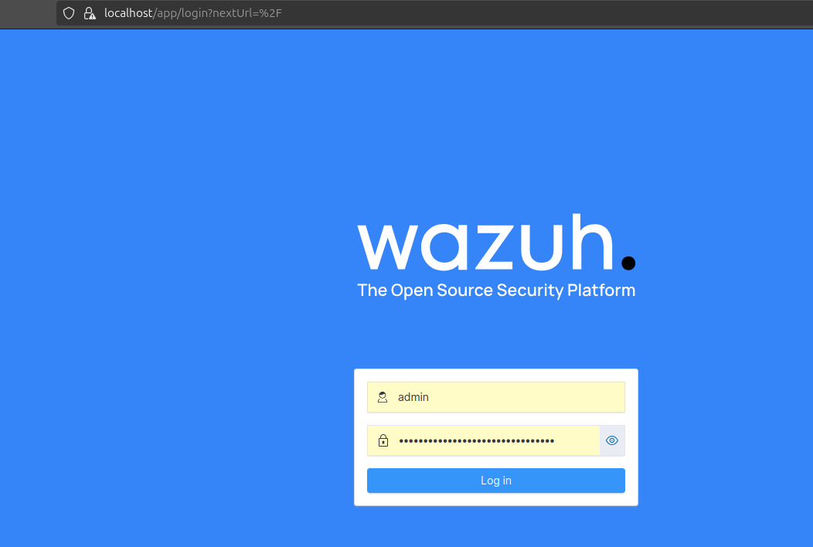
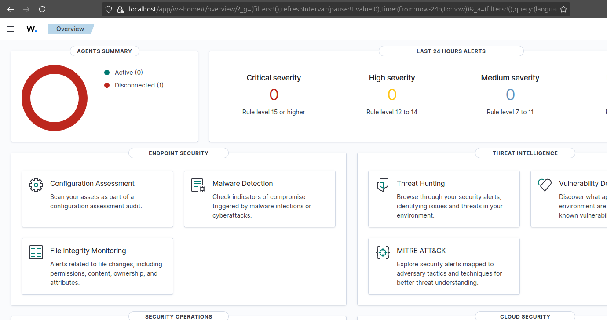

# Wazuh Single-node Deployment on Docker

Wazuh is a free and open source security platform that unifies XDR and SIEM capabilities. It protects workloads across on-premises, virtualized, containerized, and cloud-based environments.

> This guide is based on my personal notes while setting up Wazuh using Docker. I'm sharing it to help others who want a quick and straightforward deployment, while hopefully saving some time on troubleshooting along the way.

## Wazuh central components

The central components of the Wazuh stack are: 
- Indexer: a highly scalable, full-text search and analytics engine.
- Server: analyzes the data received from the Wazuh agents, triggering alerts when threats or anomalies are detected.
- Dashboard: is a flexible and intuitive web interface for mining, analyzing, and visualizing security data. 
- Agent: a single and lightweight monitoring software that provides visibility into the endpoint's security by collecting critical system and application records, inventory data, and detecting anomalies.

# Installation step by step

1. Clone the Wazuh repository: 

> Keep in mind that the version may change. 

```
git clone https://github.com/wazuh/wazuh-docker.git -b v4.11.2
```
2. After the cloning is complete a folder named ***wazuh-docker*** will be created. Navigate inside the ***single-node*** directory inside of it.

3. Use **docker-compose** to generate a group of certificates for each node in the stack to secure communication between the nodes:

```
docker-compose -f generate-indexer-certs.yml run --rm generator
```
4. Start the Wazuh single-node deployment on the backgroumd: 

```
docker-compose up -d
```
5. Once the **docker-compose** is finished you'll be ready to access the Wazuh Dashboard.

> Access localhost on https:/127.0.0.1

> The default username and password for the Wazuh dashboard are **admin** and **SecretPassword**






