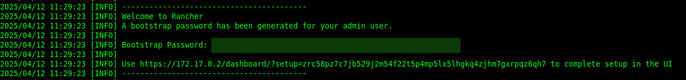

<!---->

# Install Rancher in 3 different ways
Rancher is a Kubernetes management tool to deploy and run clusters anywhere and on any provider.

>This guide is a straightforward and hands-on walkthrough based on my own experience setting up Rancher in different ways for a home lab environment. I put it together to make things easier for anyone going down the same path and hopefully help you dodge some of the headaches and troubleshooting I ran into.

## Option 1: Rancher on a Single Node Using Docker ([Official Docs](https://ranchermanager.docs.rancher.com/getting-started/installation-and-upgrade/other-installation-methods/rancher-on-a-single-node-with-docker))
- **Provision Linux Host**

Provision a single Linux host to launch your Rancher server.
- **Choose an SSL Option and Install Rancher**

Run the following command for a default installation with Rancher-generated Self-signed Certificate
```
docker run -d --restart=unless-stopped \
  -p 80:80 -p 443:443 \
  --privileged \
  rancher/rancher:latest
```
- Check the status of the installation with the following command: 

```
docker logs -f *containername*
```



- Go to the browser and paste the IP address. Reset the admin password and you're ready to go. 

## Option 2: Install Rancher on K3s Cluster ([Official Docs](https://ranchermanager.docs.rancher.com/getting-started/quick-start-guides/deploy-rancher-manager/helm-cli#install-k3s-on-linux))

- In order to install Rancher you will need to have kubectl and helm installed. As i'm using the Master Node I'm exposing the KUBECONFIG variable to access the cluster form anywhere

```
curl -fsSL https://raw.githubusercontent.com/helm/helm/main/scripts/get-helm-3 | bash
export KUBECONFIG=/etc/rancher/k3s/k3s.yaml
```
> Use *helm version* to check that is properly installed

- Add the Helm repo for Rancher

```
helm repo add rancher-latest https://releases.rancher.com/server-charts/latest
```
- Create a namespace

```
kubectl create namespace cattle-system
```
- Install cert-manager to handle SSL secure certificates

```
kubectl apply -f https://github.com/cert-manager/cert-manager/releases/latest/download/cert-manager.yaml
```
- Update repo

```
helm repo update
```
- Install Rancher

```
helm install rancher rancher-latest/rancher --namespace cattle-system --create-namespace --set hostname=rancher.example.com --set replicas=1 --set bootstrapPassword=<pass>
```
> In this case *rancher.exmple.com* should be replaced with the acuatl hostname or IP address and *boostrapPassword* should be replaced by the desire one.

- In case the bootstrapPassword is not set, is possible to retrieve it using the following command: 

```
kubectl get secret --namespace cattle-system bootstrap-secret -o go-template='{{.data.bootstrapPassword|base64decode}}{{ "\n" }}'
```

- Wait for the Rancher pods to initialize

```
kubectl get pods -n cattle-system
```
- Once the Rancher deployment is complete the UI should be available on the web browser on the seleceted IP address. 

